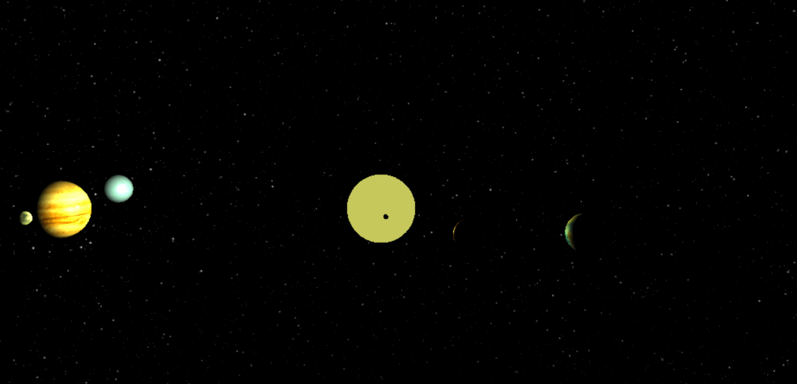
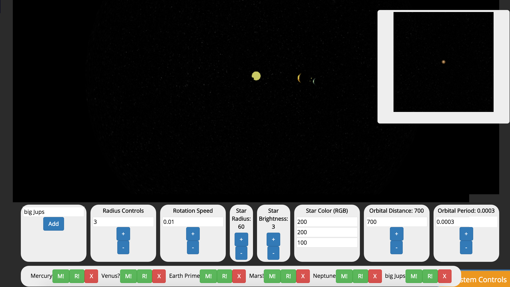

#Exoplanet generator

Link: https://universalplanetator.herokuapp.com/

It basically does this, but with a solid framerate:

 -

**But How?**

This project uses three.js and react to create an editable stellar system.  You can change the star's size, brightness, color (rgb) values, as well as add an unlimited (fps permitting) number of custom planets and moons.  Then, you can navigate through them with three.js's excellent trackball controls(http://threejs.org/examples/#misc_controls_trackball).  This is all rendered in WebGL, so it might run down your battery a bit.

Eventually, you will be able to save them, retrieve them, and edit them.  Look for that probably next week.

React is used to draw the scene and controls based on input provided by the user.

**Instructions for use**

These will become less necessary as the UI gets cleaned up, but right now it's a mess, so listen up:

These are the controls (please don't laugh I have not gotten much CSS done on this thing)

-

To make a planet, type a name for it in the name box, adjust its properties until they suit your liking, and click "add".  This will add it to the scene.  

That window in the upper-right is the "planet preview", it shows you an approximation of your planet before you add it to the scene.  The translucent blue planet in the main scene is there to preview your planet's orbital characteristics and relative size.  These help you gauge how your planet will look as you adjust its properties.

After you add a planet, it will be added to the systems planet list along with three buttons, "R!" "M!" and "X".  R is for adding rings, which is not implemented yet.  M is for adding moons, which are very much implemented.  Clicking the M will add a procedurally generated moon to that planet and animate it.  X is for deleting planets from the scene.

To view the scene without the controls visible, you can toggle them on and off with the button in the lower right.

**Technologies Used**
  -WebGL
  -threejs javascript library
  -react javascript library
  -Handlebars
  -node
  -express
  -javascript
  -jsx
  -gulp
  -CSS
  -html
  -bootstrap
  -mongoDB (coming soon!)

**Unsolved Problems**

Rings are tricky.  I also have to clean up the react a LOT.  Also, lots and lots and lots of CSS to do.  Also, the whole back end, minus login.

The camera loses its position in between scene updates

There is a momentary flicker while the scene renders.  Unsure how to fix.

Copyright 2016 Michael Sturrus but feel free to fork it
